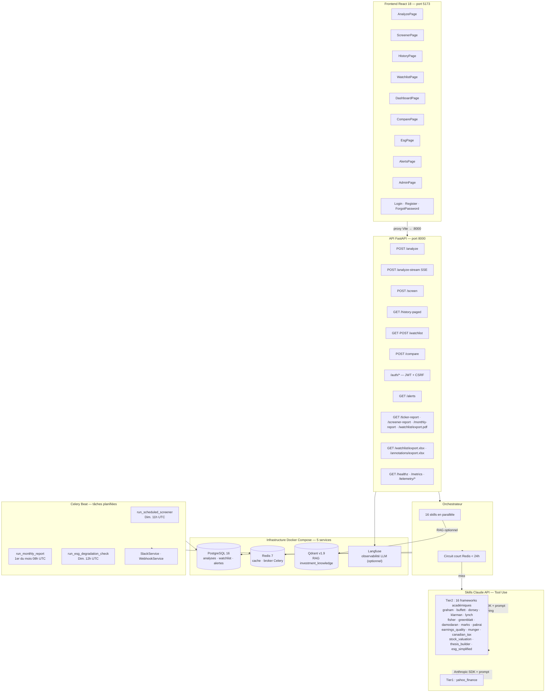

[](https://github.com/yvlar/TRADINGCLAUDE/actions/workflows/ci.yml)
[](LICENSE)
[](https://www.python.org/downloads/release/python-3110/)
[](https://fastapi.tiangolo.com)
[](https://react.dev)
[](https://docs.anthropic.com)
[](ROADMAP.md)

# TradingClaude — Copilote d'analyse financière IA

*18 frameworks d'investissement académiques · FastAPI · React 18 · Claude API Tool Use · RAG Qdrant*

TradingClaude est un outil d'analyse fondamentale IA — pas un bot de trading algorithmique. Il structure et accélère la recherche sur les actions cotées (TSX, NYSE, NASDAQ) en appliquant simultanément plusieurs grilles d'analyse rigoureuses. Concrètement, une requête `POST /analyze` sur `BNS.TO` déclenche 16 frameworks en parallèle : Graham, Buffett, Dorsey, Klarman, Damodaran, et plus encore. La philosophie du projet est de transformer une discipline value investing reproductible en checklist IA exécutable — inspirée du four-pillar (ETF passif, thématique, valeur, systématique).

**Version :** 10.28.0 — Phase 3 (Pipeline de synthèse) · **Tests :** 1 660 CI verts · 428 Vitest verts

---

## Architecture



---

## Fonctionnalités

| Catégorie | Description |
|-----------|-------------|
| **Analyse fondamentale** | 16 frameworks académiques en parallèle via Claude API Tool Use + prompt caching |
| **Screener batch** | Jusqu'à 20 tickers en une requête, classement par composite_score |
| **RAG Qdrant** | ~67 documents de référence (formules, seuils, tableaux) indexés dans `investment_knowledge` |
| **Streaming SSE** | `POST /analyze-stream` — résultats skill par skill en temps réel |
| **Watchlist** | Surveillance de positions, seuils ESG et prix configurables, sparkline composite 30j |
| **Alertes Celery** | ESG dégradation, composite baisse, prix seuil — centralisées dans `GET /alerts` |
| **Exports** | PDF (ticker, screener, watchlist, rapport mensuel), Excel/CSV (watchlist, annotations) |
| **Palette ⌘K** | Navigation clavier (Ctrl+K / ⌘K) — pages, analyses récentes, ticker rapide, recherche RAG inline |
| **Authentification** | Cookie JWT httpOnly + refresh token rotation + CSRF double-submit + argon2 |
| **Observabilité** | Langfuse (optionnel), métriques WebSocket live, eval drift Celery |
| **Multi-users** | Clés API Bearer, gestion admin (`/admin/keys`), rétrocompat variable `API_KEY` env |

---

## Les 17 skills

### Tier 2 — Frameworks d'investissement académiques (16)

| Skill | Framework |
|-------|-----------|
| `graham_analysis` | Benjamin Graham — critères défensif/entreprenant, *The Intelligent Investor* |
| `earnings_quality` | Beneish M-Score, Altman Z-Score, Piotroski F-Score, Montier C-Score, Sloan accruals |
| `dorsey_moat` | Pat Dorsey — 5 sources de moat (intangibles, switching costs, network effects, cost advantages, efficient scale) |
| `buffett_quality` | Warren Buffett — 4 filtres, owner earnings, wonderful businesses at fair prices |
| `stock_valuation_triangulation` | DCF + multiples comparables (EV/EBITDA, P/E forward) + méthode sectorielle (SOTP/NAV/FFO) |
| `investment_thesis_builder` | Thèse formelle — scénarios bull/base/bear, kill criteria, devil's advocate |
| `munger_mental_models` | Charlie Munger — 25 biais cognitifs, inversion, lollapalooza effects |
| `canadian_tax_considerations` | CELI, REER, CELIAPP, fiscalité QC, Norbert's Gambit, règles perte apparente |
| `lynch_categories` | Peter Lynch — 6 catégories, tenbaggers, ratio PEG, *invest in what you know* |
| `fisher_scuttlebutt` | Phil Fisher — 15 points, méthode scuttlebutt qualitative |
| `klarman_margin` | Seth Klarman — préservation du capital, marge de sécurité absolue, situations spéciales |
| `greenblatt` | Joel Greenblatt — Magic Formula (ROC + earnings yield), spinoffs |
| `damodaran_narrative` | Aswath Damodaran — alignement narrative/numbers, possible vs probable |
| `marks_cycles` | Howard Marks — pendule du sentiment, second-level thinking, cycles |
| `pabrai_dhandho` | Mohnish Pabrai — 9 principes Dhandho, cloning 13F, paris asymétriques |
| `esg_simplified` | 15 critères proxy (5E + 5S + 5G) — score 0–15, verdict ESG_FORT/MODERE/FAIBLE |

### Tier 1 — Extracteur de données brutes (1)

| Skill | Source |
|-------|--------|
| `yahoo_finance_extractor` | Yahoo Finance via `yfinance` — ratios, prix, bilans (source unique) |

---

## Prérequis

- Docker + Docker Compose
- Node.js 22+ (frontend uniquement)
- Python 3.11+ (développement local hors Docker)
- Clé API Anthropic (`ANTHROPIC_API_KEY`)
- Optionnel : `OPENAI_API_KEY` (RAG Qdrant), `LANGFUSE_SECRET_KEY` (observabilité), `SLACK_WEBHOOK_URL` (alertes Slack)

---

## Démarrage rapide

### 1. Cloner et configurer

```bash
git clone https://github.com/yvlar/TRADINGCLAUDE.git
cd TRADINGCLAUDE
cp .env.example .env
# Éditer .env — ajouter au minimum ANTHROPIC_API_KEY
```

### 2. Démarrer l'infrastructure (5 services)

```bash
docker-compose up -d
curl localhost:8000/healthz
# → {"status": "ok", "postgres": "ok", "qdrant": "ok"}
```

### 3. Première analyse

```bash
# Analyser une action canadienne (TSX)
curl -X POST localhost:8000/analyze \
  -H "Content-Type: application/json" \
  -d '{"ticker": "BNS.TO"}'

# Screener multi-tickers
curl -X POST localhost:8000/screen \
  -H "Content-Type: application/json" \
  -d '{"tickers": ["BNS.TO", "TD.TO", "RY.TO"]}'
```

### 4. Frontend React

```bash
cd frontend
npm install
npm run dev
# → http://localhost:5173
```

---

## Variables d'environnement

| Variable | Obligatoire | Description |
|----------|-------------|-------------|
| `ANTHROPIC_API_KEY` | ✅ | Clé API Claude (Anthropic) |
| `CLAUDE_MODEL` | — | Défaut : `claude-sonnet-4-6` |
| `DATABASE_URL` | — | PostgreSQL (défaut Docker Compose) |
| `REDIS_URL` | — | Redis (défaut Docker Compose) |
| `JWT_SECRET_KEY` | ✅ | Secret signature JWT |
| `API_SECRET_KEY` | ✅ | Secret CSRF + sessions |
| `API_KEY` | — | Bearer token legacy (rétrocompat Sprint 62) |
| `OPENAI_API_KEY` | — | Embeddings RAG Qdrant (optionnel) |
| `LANGFUSE_SECRET_KEY` | — | Observabilité LLM Langfuse (optionnel) |
| `SLACK_WEBHOOK_URL` | — | Alertes Slack (optionnel) |
| `WEBHOOK_URL` | — | Notifications webhook (optionnel) |
| `CLAUDE_TIMEOUT_S` | — | Timeout appels Claude, défaut `120` |

Voir `.env.example` pour la liste complète avec valeurs exemples.

---

## Pages React (13)

| Route | Page | Description |
|-------|------|-------------|
| `/` | AnalyzePage | Saisie ticker + ratios, auto-fill Yahoo Finance, streaming SSE skill par skill |
| `/screener` | ScreenerPage | Batch 2–20 tickers, tableau trié composite_score, export PDF |
| `/history` | HistoryPage | Historique paginé, recherche full-text, filtre dates, PDF, annotations, suppression |
| `/watchlist` | WatchlistPage | Positions surveillées, seuils ESG/prix inline, sparkline 30j, exports PDF/Excel |
| `/dashboard` | DashboardPage | Métriques WebSocket live, comparaison multi-tickers recharts, eval drift |
| `/compare` | ComparePage | Tableau multi-skills côte à côte, bouton Analyser opt-in, toggle streaming SSE |
| `/esg` | EsgPage | Scores ESG watchlist, badges FORT/MODERE/FAIBLE, tableau tritable |
| `/alerts` | AlertsPage | Alertes Celery récentes (ESG · composite · prix), tableau horodaté |
| `/admin` | AdminPage | Gestion clés API Bearer (créer · lister · révoquer) |
| `/login` | LoginPage | Authentification cookie JWT httpOnly + CSRF |
| `/register` | RegisterPage | Inscription email/mot de passe |
| `/forgot-password` | ForgotPasswordPage | Demande réinitialisation mot de passe |
| `/reset-password` | ResetPasswordPage | Réinitialisation via token signé (itsdangerous) |
| `/recherche` | SearchPage | Recherche sémantique RAG en langage naturel — résultats avec score de similarité |

---

## API — Endpoints principaux

```
# Analyse
POST   /analyze                         Analyse complète 16 skills (sync)
POST   /analyze-stream                  Streaming SSE skill par skill
POST   /screen                          Screener batch 2–20 tickers
GET    /extract?ticker=                 Auto-remplissage ratios Yahoo Finance

# Watchlist
GET    /watchlist                        Lister les positions surveillées
POST   /watchlist                        Ajouter un ticker
DELETE /watchlist/{id}                   Supprimer
PATCH  /watchlist/{id}/esg-threshold     Configurer seuil ESG (0–15)
PATCH  /watchlist/{id}/price-threshold   Configurer seuil de prix (%)
GET    /watchlist/esg-scores             Scores ESG triables
GET    /watchlist/export.xlsx            Export Excel enrichi (composite + ESG + annotations)
GET    /watchlist/export.pdf             Export PDF composite_score + verdicts

# Historique et annotations
GET    /history                          Curseur (rétrocompat)
GET    /history-paged                    Pagination offset/limit + total_count + recherche + dates
DELETE /history/{analysis_id}            Supprimer une analyse (admin)
POST   /annotations                      Annoter une analyse
GET    /annotations                      Lire annotations par ticker
GET    /annotations/export.csv           Export CSV
GET    /annotations/export.xlsx          Export Excel

# Comparaison et rapports
POST   /compare                          Comparer 2–5 tickers sans appel Claude
GET    /composite-history/{ticker}       Évolution composite_score dans le temps
GET    /esg-history/{ticker}             Historique scores ESG
GET    /alerts?limit=50                  Alertes Celery récentes (ESG + composite + prix)
GET    /ticker-report/{ticker}           Rapport PDF multi-pages par ticker (90 jours)
GET    /screener-report                  Rapport PDF screener
GET    /monthly-report                   Rapport PDF mensuel enrichi (section ESG incluse)

# Auth
POST   /auth/register                    Inscription
POST   /auth/login                       Connexion cookie JWT httpOnly + CSRF
POST   /auth/logout                      Blacklist JWT + invalidation refresh
POST   /auth/refresh                     Rotation refresh token (détection vol)
GET    /auth/me                          Profil depuis cookie access_token
POST   /auth/forgot-password             Token réinitialisation (anti-énumération)
POST   /auth/reset-password              Réinitialisation avec token signé

# Administration
POST   /admin/keys                       Créer une clé API
GET    /admin/keys                       Lister les clés
DELETE /admin/keys/{id}                  Révoquer une clé

# Observabilité
GET    /healthz                          Processus + PostgreSQL + Qdrant
GET    /metrics?days=30                  Coûts cumulés, cache hit rate, top tickers
GET    /metrics/skill-analyses           Drill-down coût/analyses par skill
GET    /semantic-search?q=&k=5          Recherche sémantique RAG (rag_enabled=false si OPENAI_API_KEY absent)
GET    /telemetry/summary|costs|cache|latency
GET    /telemetry/eval-drift             Dérive des evals vs golden dataset
```

---

## Tâches Celery planifiées

| Tâche | Schedule | Action |
|-------|----------|--------|
| `run_scheduled_screener` | Dimanche 11h00 UTC | Screener watchlist complet → webhook PDF + Slack si tickers FORT |
| `run_esg_degradation_check` | Dimanche 12h00 UTC | Détecte dégradation ESG → `alert_history` + Slack |
| `run_monthly_report` | 1er du mois 08h00 UTC | Rapport PDF mensuel (composite + section ESG) → webhook + Slack |

---

## Tests

```bash
# Backend — aucun token Claude consommé
python -m pytest tests/ --ignore=tests/e2e --ignore=tests/evals
# → 1 660 passed, 3 skipped, 1 xfailed

# Frontend
cd frontend && npm run test
# → 428 passed

# Lint + typecheck
ruff check app/
mypy app/
cd frontend && npm run lint && npm run typecheck
```

### CI GitHub Actions — 4 jobs

| Job | Outil |
|-----|-------|
| `test-backend` | `pytest tests/ --ignore=tests/e2e --ignore=tests/evals` |
| `test-frontend` | `vitest run` |
| `lint` | `ruff check app/` + `eslint frontend/src/` |
| `typecheck` | `mypy app/` + `tsc --noEmit` |

---

## Structure du projet

```
TRADINGCLAUDE/
├── app/
│   ├── api/
│   │   ├── main.py             # FastAPI lifespan, tables idempotentes, app.state
│   │   └── endpoints/          # Un module par groupe d'endpoints
│   ├── orchestrator/           # Orchestrateur 16 skills parallèles + cache Redis
│   ├── skills/
│   │   ├── tier1/              # yahoo_finance
│   │   └── tier2/              # 16 frameworks (SkillBase + Tool Use + prompt caching)
│   ├── services/               # AlertHistoryService, WatchlistService, SlackService, etc.
│   ├── workers/
│   │   ├── celery_app.py       # Config Celery + beat schedule
│   │   └── tasks.py            # Tâches planifiées (screener, ESG, rapport mensuel)
│   ├── rag/                    # Client Qdrant + embeddings OpenAI
│   └── utils/                  # retry.py, ticker_sanitizer.py, esg_utils.py
├── frontend/
│   └── src/
│       ├── pages/              # 13 pages React
│       ├── components/         # Composants partagés (shadcn/ui + custom)
│       ├── api/                # Fonctions fetch par domaine
│       └── types/index.ts      # Types TypeScript synchronisés avec Pydantic backend
├── tests/                      # Pyramide pytest (unit → integration → e2e → evals)
├── .claude/
│   ├── rules/                  # 16 fichiers de règles path-scoped
│   └── skills/                 # 16 SKILL.md + ~67 documents références RAG
├── infra/postgres/init.sql     # DDL idempotent — toutes les tables
├── docker-compose.yml          # 5 services : copilote, worker, postgres, qdrant, redis
├── pyproject.toml              # ruff + mypy
└── .github/
    ├── workflows/ci.yml        # 4 jobs CI
    └── dependabot.yml          # pip + npm weekly
```

---

## RAG (Base de connaissances)

Si `OPENAI_API_KEY` est présent, le service active la recherche vectorielle dans Qdrant.
Le corpus contient ~67 documents de référence couvrant les 16 frameworks Tier 2.

```bash
# Ingestion des documents de référence
python scripts/ingest_rag.py --path .claude/skills/
```

---

## Sécurité

Voir [SECURITY.md](SECURITY.md) pour signaler une vulnérabilité.

- Clés API uniquement via variables d'environnement (`.env` jamais commité)
- Cookie JWT httpOnly (15 min) + refresh token rotation + détection de vol par famille (Redis)
- CSRF double-submit cookie sur toutes les mutations
- Rate limiting login : 5 tentatives / 15 minutes (Redis)
- Argon2 pour le hachage des mots de passe
- Rétrocompatibilité Bearer API key pour intégrations existantes

---

## Contribuer

Voir [CONTRIBUTING.md](CONTRIBUTING.md). En résumé :

1. Forker → branche feature (`git checkout -b feat/nom-feature`)
2. Respecter les conventions `.claude/rules/conventions-code-base.md` (bilingue FR/EN, typage strict, async/await)
3. Tout nouveau skill tier2 requiert son `SKILL.md` + `references/` pour la cohérence RAG
4. `pytest tests/ --ignore=tests/e2e --ignore=tests/evals` doit passer sans token Claude
5. Pull request avec le template fourni

---

## Licence

MIT — voir [LICENSE](LICENSE).

---

*TradingClaude — Yves Larivière, Québec · v10.28.0 · Phase 3 active · Dernière mise à jour : 2026-06-01*
